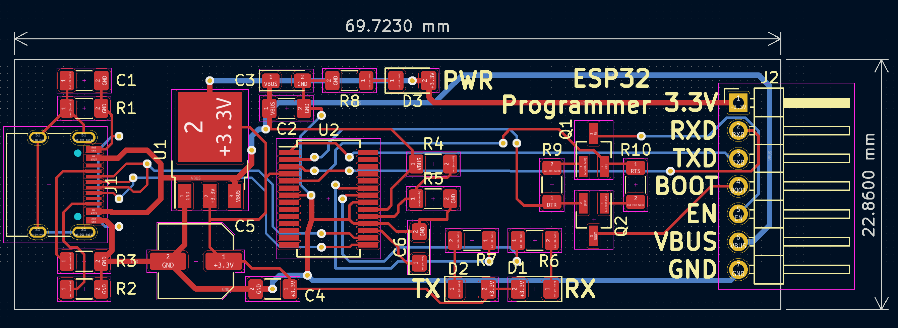

# ESP32 USB-C programmer with CY7C65213

This is a simple USB-C programmer that uses the CY7C65213 UART bridge controller. This repository contains KiCad 6 project files with gerber files exported. This board is capable of DTR and RTS, therefore the program upload experience should be without any problem.



## NOTE

* Do not connect a capacitor on the BOOT pin (GPIO 0 pin) towards the ground. It will cause the ESP32 to jump to the programming mode on power up.
* Use 1uF capacitor between the ESP32 reset pin (also known as EN or PN pin) between it and the ground. You will also need 10K pull-up resistor between that same reset pin and the + 3.3V.
* The Rx, Tx, Boot, and En pins on this board are 3.3V tolerant only.

## Connection schematic

Use the following schematic to connect this programmer to ESP32


## Why CY7C65213?

It works in Linux and Windows out of the box without the need to install any drivers. Compared to the CH340 UART controller, the drivers for CY7C65213 are stable and mature. I do not want to install some shady CH340 drivers that work half of the time.

## Programming (platformio)

If you are using platformio for programming, you can use the following example below:

```ini
[env:esp32s3]
platform = espressif32        # Required
board = adafruit_feather_esp32s3_nopsram # Required, or choose similar
framework = espidf            # Or "arduino", your choice.
upload_port = /dev/ttyACM0    # Or COM3 or similar for Windows
board_build.flash_mode = dio  # Might be needed for a successful upload to ESP32-S3
monitor_port = /dev/ttyACM0   # Or COM3 or similar for Windows
monitor_speed = 115200        # This is the default value
```

## Programming (Arduino)

Simply choose the correct COM port from the top menu bar, and use the Adafruit Feather ESP32 board. (It should work with any board).
